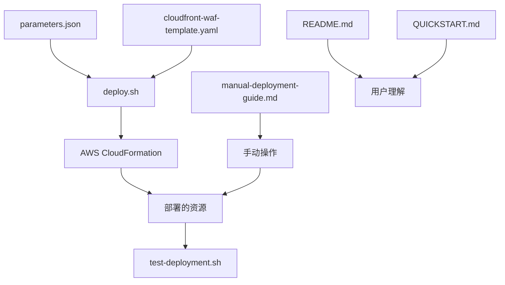

# 📁 项目结构说明

```
cloudfront-waf-deployment/
├── 📄 README.md                          # 主要文档和使用指南
├── 📄 QUICKSTART.md                      # 5分钟快速开始指南
├── 📄 PROJECT_STRUCTURE.md               # 本文件 - 项目结构说明
├── 📄 manual-deployment-guide.md         # AWS 控制台手动部署指南
│
├── 🔧 CloudFormation 模板和配置
│   ├── 📄 cloudfront-waf-template.yaml   # 主要的 CloudFormation 模板
│   ├── 📄 parameters.json                # 参数配置文件
│   └── 📁 examples/
│       └── 📄 parameters-example.json    # 参数配置示例
│
├── 🚀 部署和测试脚本
│   ├── 📄 deploy.sh                      # 自动部署脚本
│   └── 📄 test-deployment.sh             # 部署后测试脚本
│
└── 📊 生成的配置文件 (部署过程中创建)
    ├── 📄 cloudfront-config.json         # CloudFront 配置
    ├── 📄 cloudfront-config-no-waf.json  # 无 WAF 的配置
    ├── 📄 cloudfront-config-with-waf.json # 带 WAF 的配置
    ├── 📄 waf-config.json                # WAF 配置
    └── 📄 waf-config-updated.json        # 更新的 WAF 配置
```

## 📋 文件说明

### 📚 文档文件

| 文件 | 用途 | 目标用户 |
|------|------|----------|
| `README.md` | 完整的项目文档，包含架构、部署、配置、故障排除 | 所有用户 |
| `QUICKSTART.md` | 5分钟快速部署指南 | 急需部署的用户 |
| `manual-deployment-guide.md` | AWS 控制台手动操作步骤 | 偏好手动操作的用户 |
| `PROJECT_STRUCTURE.md` | 项目文件结构说明 | 开发者和维护者 |

### 🔧 核心部署文件

| 文件 | 用途 | 重要性 |
|------|------|--------|
| `cloudfront-waf-template.yaml` | CloudFormation 主模板 | ⭐⭐⭐ 核心 |
| `parameters.json` | 部署参数配置 | ⭐⭐⭐ 必需 |
| `deploy.sh` | 自动化部署脚本 | ⭐⭐ 推荐 |

### 🧪 测试和示例

| 文件 | 用途 | 使用场景 |
|------|------|----------|
| `test-deployment.sh` | 部署后功能测试 | 验证部署结果 |
| `examples/parameters-example.json` | 参数配置示例 | 参考和学习 |

## 🚀 使用流程

### 新用户快速开始
1. 📖 阅读 `QUICKSTART.md`
2. 📝 复制 `examples/parameters-example.json` 到 `parameters.json`
3. ✏️ 编辑 `parameters.json` 配置您的参数
4. 🚀 运行 `./deploy.sh`
5. 🧪 运行 `./test-deployment.sh` 验证

### 详细了解和自定义
1. 📖 阅读完整的 `README.md`
2. 🔧 根据需要修改 `cloudfront-waf-template.yaml`
3. 🚀 使用 `deploy.sh` 部署
4. 📊 查看 CloudWatch 监控

### 手动部署偏好者
1. 📖 阅读 `manual-deployment-guide.md`
2. 🖱️ 按步骤在 AWS 控制台操作
3. 🧪 使用 `test-deployment.sh` 验证结果

## 🔄 文件依赖关系



## 📝 自定义指南

### 修改 Lambda@Edge 函数
1. 编辑 `cloudfront-waf-template.yaml` 中的 `LambdaEdgeFunction` 资源
2. 修改 `Code.ZipFile` 部分的 JavaScript 代码
3. 重新部署

### 添加新的 WAF 规则
1. 在 `cloudfront-waf-template.yaml` 中的 `WAFWebACL` 资源添加新规则
2. 更新 `Rules` 数组
3. 调整优先级

### 修改 CloudFront 行为
1. 编辑 `cloudfront-waf-template.yaml` 中的 `CloudFrontDistribution` 资源
2. 修改 `DefaultCacheBehavior` 或添加 `CacheBehaviors`
3. 重新部署

## 🔐 安全注意事项

- `parameters.json` 包含 IP 地址信息，请勿提交到公共代码库
- 定期更新 IP 白名单
- 监控 WAF 日志以识别潜在威胁
- 使用最小权限原则配置 IAM 角色

## 🤝 贡献指南

1. 📋 遵循现有的文件命名约定
2. 📝 更新相关文档
3. 🧪 确保测试脚本正常工作
4. 📊 添加适当的注释和说明

---

**需要帮助？** 查看 [README.md](README.md) 获取详细信息。
