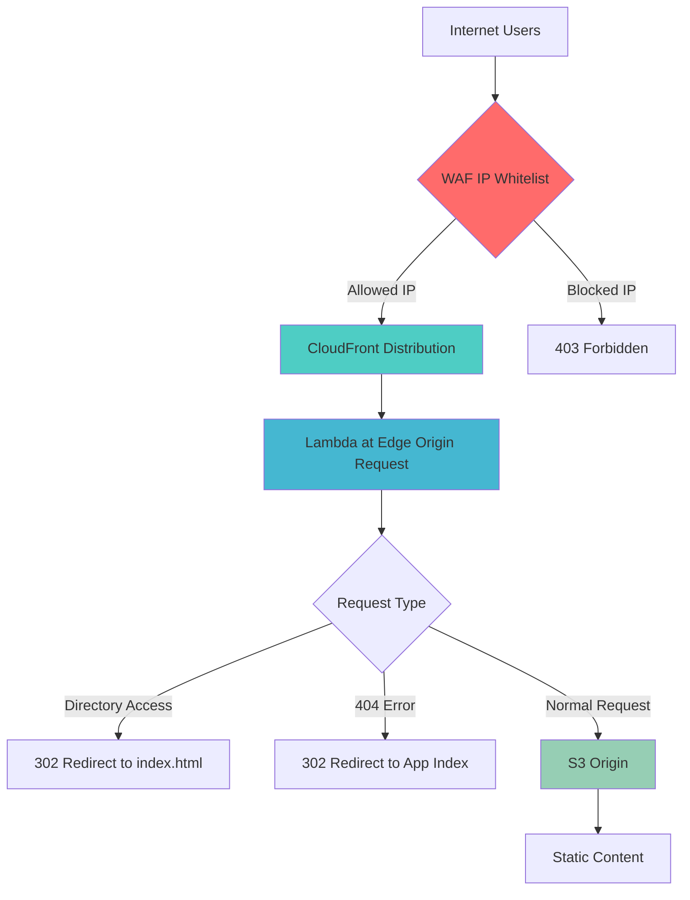

# 🛡️ CloudFront Distribution with WAF IP Whitelist Protection

[](https://aws.amazon.com/cloudfront/)
[](https://aws.amazon.com/waf/)
[](https://aws.amazon.com/lambda/edge/)
[](https://opensource.org/licenses/MIT)
[](https://aws.amazon.com/cloudformation/)

> 🚀 **一键部署** CloudFront + WAF IP 白名单 + Lambda@Edge 404重定向的完整解决方案

## 📖 项目简介

这是一个生产就绪的 AWS CloudFront 分发解决方案，集成了 WAF IP 白名单保护和 Lambda@Edge 智能重定向功能。基于真实生产环境配置，提供完整的自动化部署和详细文档。

### 🎯 核心特性

- 🛡️ **WAF IP 白名单保护** - 支持 IPv4/IPv6 双栈，只允许指定 IP 访问
- 🔄 **Lambda@Edge 智能重定向** - 自动处理 404 错误和子目录访问
- 🌐 **CloudFront CDN** - 全球内容分发，HTTP/2 和 IPv6 支持
- 🚀 **一键部署** - CloudFormation 模板 + 自动化脚本
- 📊 **完整监控** - CloudWatch 指标和 WAF 日志
- 📚 **详细文档** - 从快速开始到生产部署

## 🏗️ 架构图





## 🚀 快速开始

### 前置要求

- AWS CLI 已安装并配置
- 具有 CloudFormation、CloudFront、WAF、Lambda 权限的 AWS 账户
- 已有 S3 存储桶和 Origin Access Identity (OAI)

### 5分钟部署

1. **克隆项目**
   ```bash
   git clone https://github.com/your-username/cloudfront-waf-deployment.git
   cd cloudfront-waf-deployment
   ```

2. **获取您的 IP 地址**
   ```bash
   curl -s https://ipinfo.io/ip
   ```

3. **配置参数**
   ```bash
   cp examples/parameters-example.json parameters.json
   # 编辑 parameters.json，填入您的配置
   ```

4. **一键部署**
   ```bash
   ./deploy.sh my-cloudfront-stack my-aws-profile us-east-1
   ```

5. **验证部署**
   ```bash
   ./test-deployment.sh d1234567890abc.cloudfront.net
   ```

## 📁 项目结构

```
├── 📄 README.md                          # 项目说明文档
├── 📄 QUICKSTART.md                      # 5分钟快速开始
├── 📄 manual-deployment-guide.md         # 手动部署指南
├── 🔧 cloudfront-waf-template.yaml       # CloudFormation 主模板
├── 📄 parameters.json                    # 参数配置文件
├── 🚀 deploy.sh                          # 自动部署脚本
├── 🧪 test-deployment.sh                 # 功能测试脚本
├── 📁 examples/
│   └── parameters-example.json           # 配置示例
└── 📋 LICENSE                            # MIT 许可证
```

## ⚙️ 配置参数

| 参数 | 描述 | 示例值 |
|------|------|--------|
| `S3BucketDomainName` | S3 存储桶域名 | `my-bucket.s3.us-east-1.amazonaws.com` |
| `OriginAccessIdentityId` | CloudFront OAI ID | `E1K3Y1A1IBH4GU` |
| `AllowedIPv4Addresses` | 允许的 IPv4 地址 | `203.0.113.1/32,198.51.100.1/32` |
| `AllowedIPv6Addresses` | 允许的 IPv6 地址 | `2001:db8::1/128` |
| `DistributionComment` | 分发描述 | `Production CDN with WAF` |
| `PriceClass` | 价格等级 | `PriceClass_All` |

## 🛡️ WAF 保护功能

### IP 白名单规则
- ✅ **IPv4 支持**: 多个 IPv4 地址，CIDR 格式
- ✅ **IPv6 支持**: 多个 IPv6 地址，CIDR 格式  
- ❌ **默认阻止**: 未在白名单中的所有 IP
- 📊 **监控**: CloudWatch 指标和采样请求

### 安全特性
- 🔒 只有白名单 IP 可以访问
- 🔄 支持动态 IP 更新
- 📈 详细的访问日志和指标
- 🚫 自动阻止恶意请求

## 🔄 Lambda@Edge 重定向

### 智能重定向规则

1. **子目录访问重定向**
   ```
   /website1/ → /website1/index.html
   /website2/ → /website2/index.html
   /app1/ → /app1/index.html
   ```

2. **404 错误重定向**
   ```
   /website1/any-path → /website1/index.html
   /website2/any-path → /website2/index.html
   /app1/any-path → /app1/index.html
   ```

3. **静态资源保护**
   - 不重定向 `.html`, `.css`, `.js` 文件
   - 保持原始请求路径

## 📊 监控和日志

### CloudWatch 指标
- **WAF 指标**: `AllowIPv4WhitelistRule`, `AllowIPv6WhitelistRule`
- **CloudFront 指标**: 请求数量、错误率、缓存命中率
- **Lambda@Edge 日志**: 各边缘位置的执行日志

### 日志位置
- **Lambda@Edge**: `/aws/lambda/us-east-1.{FunctionName}`
- **WAF 日志**: 可配置到 S3 或 CloudWatch Logs

## 🧪 测试验证

### 功能测试
```bash
# 测试正常访问（从白名单 IP）
curl -I https://your-distribution.cloudfront.net
# 预期: HTTP/2 200

# 测试 WAF 阻止（从非白名单 IP）
curl -I https://your-distribution.cloudfront.net
# 预期: HTTP/2 403

# 测试 Lambda@Edge 重定向
curl -I https://your-distribution.cloudfront.net/website1/
# 预期: HTTP/2 302 → /website1/index.html
```

### 自动化测试
```bash
./test-deployment.sh your-distribution.cloudfront.net
```

## 🔄 更新和维护

### 更新 IP 白名单
```bash
# 方法1: 通过 CloudFormation
# 编辑 parameters.json，然后重新部署
./deploy.sh your-stack-name

# 方法2: 通过 AWS CLI
aws wafv2 update-ip-set \
  --scope CLOUDFRONT \
  --id YOUR_IP_SET_ID \
  --addresses "1.2.3.4/32,5.6.7.8/32"
```

### 更新 Lambda@Edge 函数
1. 修改 `cloudfront-waf-template.yaml` 中的函数代码
2. 重新部署 CloudFormation 栈
3. 等待 CloudFront 分发更新完成

## 💰 成本估算

### 主要成本组件
- **CloudFront**: 按数据传输和请求数量计费
- **WAF**: $1/月 + $0.60/百万请求
- **Lambda@Edge**: $0.60/百万请求 + 计算时间
- **CloudWatch**: 日志和指标存储

### 成本优化建议
- 选择合适的 CloudFront 价格等级
- 配置适当的缓存策略
- 监控和优化 Lambda@Edge 执行时间

## 🚨 故障排除

### 常见问题

<details>
<summary>403 错误 - 无法访问</summary>

- 检查 IP 是否在白名单中
- 验证 WAF 规则配置
- 确认 S3 存储桶策略正确
</details>

<details>
<summary>Lambda@Edge 重定向不工作</summary>

- 查看 CloudWatch 日志
- 验证函数权限
- 检查函数代码语法
</details>

<details>
<summary>部署失败</summary>

- 检查 IAM 权限
- 验证参数格式
- 查看 CloudFormation 事件
</details>

### 调试命令
```bash
# 查看 CloudFormation 事件
aws cloudformation describe-stack-events --stack-name your-stack-name

# 查看 WAF 采样请求
aws wafv2 get-sampled-requests \
  --web-acl-arn YOUR_WAF_ARN \
  --scope CLOUDFRONT

# 查看 Lambda@Edge 日志
aws logs describe-log-groups --log-group-name-prefix "/aws/lambda/us-east-1"
```

## 🔐 安全最佳实践

- ✅ 定期更新 IP 白名单
- ✅ 启用 CloudTrail 记录 API 调用
- ✅ 配置 CloudWatch 告警
- ✅ 定期审查访问日志
- ✅ 使用最小权限原则

## 📚 文档

- [📖 完整文档](README.md) - 详细的使用指南
- [🚀 快速开始](QUICKSTART.md) - 5分钟部署指南
- [🖱️ 手动部署](manual-deployment-guide.md) - AWS 控制台操作步骤
- [📁 项目结构](PROJECT_STRUCTURE.md) - 文件结构说明

## 🤝 贡献

欢迎贡献代码和改进建议！

1. Fork 本项目
2. 创建特性分支 (`git checkout -b feature/AmazingFeature`)
3. 提交更改 (`git commit -m 'Add some AmazingFeature'`)
4. 推送到分支 (`git push origin feature/AmazingFeature`)
5. 开启 Pull Request

## 📄 许可证

本项目采用 MIT 许可证 - 查看 [LICENSE](LICENSE) 文件了解详情。

## ⭐ 支持项目

如果这个项目对您有帮助，请给个 ⭐ Star！

## 📞 联系方式

- 📧 Email: your-email@example.com
- 🐛 Issues: [GitHub Issues](https://github.com/your-username/cloudfront-waf-deployment/issues)
- 💬 Discussions: [GitHub Discussions](https://github.com/your-username/cloudfront-waf-deployment/discussions)

## 🏷️ 标签

`aws` `cloudfront` `waf` `lambda-edge` `cdn` `security` `infrastructure` `cloudformation` `devops` `automation`

---

<div align="center">

**🚀 让您的 CloudFront 更安全、更智能！**

[开始使用](QUICKSTART.md) • [查看文档](README.md) • [报告问题](https://github.com/your-username/cloudfront-waf-deployment/issues)

</div>
